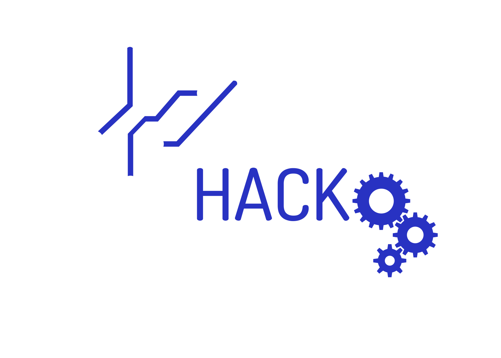

#  HackUMass Website

**Check it out here: [hackumass.com](https://hackumass.com/)!**

## How does it work?

- **HTML**
  - [index.html](https://github.com/fuseumass/hackumass.github.io/blob/master/index.html): This is the main HTML file that is served on hackumass.com, and is used to showcase HackUMass's fabulous events over the years, its unique appeal, some frequently asked questions, our sponsors, and the team behind it all!
  - [apply.html](https://github.com/fuseumass/hackumass.github.io/blob/master/apply.html): This HTML file is served on hackumass.com/apply, and is used for entertaining applications for joining the HackUMass Organizing Team!
  - [maintenance.html](https://github.com/fuseumass/hackumass.github.io/blob/master/maintenance.html): This HTML file is served on hackumass.com/maintenance, and the users are redirecte here when the HackUMass Dashboard is down or undergoing maintenance.
  - [schedule.html](https://github.com/fuseumass/hackumass.github.io/blob/master/schedule.html): This HTML file is served on hackumass.com/schedule, and is used to display the events scheduled for the current HackUMass event, including a link to the HackUMass Dashboard schedule (which is more detailed).
- **CSS**
  - [TheSaas](http://thetheme.io/thesaas/uikit/): CSS classes and UI components from an elegant, modern and fully customizable SaaS and WebApp template powered by Bootstrap 4
  - [Custom CSS](https://github.com/fuseumass/hackumass.github.io/blob/master/assets/css/style.css): Customized CSS written by the FuseUMass team to build the HackUMass website
- **JavaScript (jQuery)**
  - [TheSaas](http://thetheme.io/thesaas/uikit/): JS functions for managing TheSaas CSS classes (animations, loading, etc.) and other dynamic UI components (modals, etc.)
  - [script.js](https://github.com/fuseumass/hackumass.github.io/blob/master/assets/js/script.js): JS file for configuring TheSaaS and Google APIs for using in the future.
  - [schedule.js](https://github.com/fuseumass/hackumass.github.io/blob/master/assets/js/schedule.js): JS file for dynamically generating the HackUMass public-facing schedule.
  - [isInViewport.js](https://github.com/fuseumass/hackumass.github.io/blob/master/assets/js/isInViewport.js): JS file for updating renders based on the desired components being present in the viewport.

## Other Useful Information

### Facing any issues?

If you experience any issues or encounter any bugs, please file an issue on the [GitHub issues page](https://github.com/fuseumass/hackumass.github.io/issues) for this repository.

### Want your own version with this template?

Feel free to build your own event website by creating a fork and modifying it to your needs! Please make sure that:

- You remove all original textual content from all `.html` files.
- You remove all items from `./assets/` and `./legal/` directories.
- You remove the `CNAME` file with hackumass.com as domain name.
- You give credits to the [contributors and authors](https://github.com/fuseumass/hackumass.github.io/graphs/contributors) of this repository.
